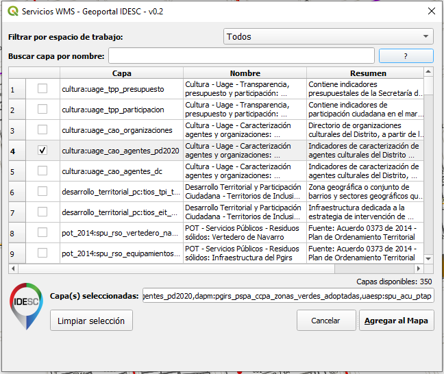

# IDESCali WMS - QGIS Plugin v0.2

Este plugin provee acceso a los servicios WMS de la Infraestructura de Datos Espaciales de Santiago de Cali (IDESC)

This plugin provides access to WMS services from the Spatial Data Infrastructure of Santiago de Cali (IDESC)

https://www.cali.gov.co/planeacion/publicaciones/46691/servicios_wms_idesc/

## Captura / Screenshot

## Español

Con este plugin usted puede:

- Acceder a capas WMS de manera simple disponibles a través de la infraestructura de Datos Espaciales de Santiago de Cali (IDESC)

### Requerimientos

- QGIS 3x

### Descarga

El plugin puede ser descargado [idescali_ws.zip](idescali_ws.zip) e instalado en QGIS desde el administrador de complementos -> opción (Instalar a partir de ZIP)

## English

With this plugin you can:

- Access WMS layers easily available through the Spatial Data Infrastructure of Santiago de Cali (IDESC)

### Requirements

- QGIS 3.x

### Download

The plugin can be downloaded [idescali_ws.zip](idescali_ws.zip) and installed in QGIS from the plugin manager -> option (Install from ZIP)

## Creditos / Credits

Code based on the [Bhuvan ISRO's Geoportal QGIS plugin](https://github.com/brenykurien/bhuvan_web_services).

Desarrollado por / Developed by: Andres Herrera - fandresherrera@hotmail.com
