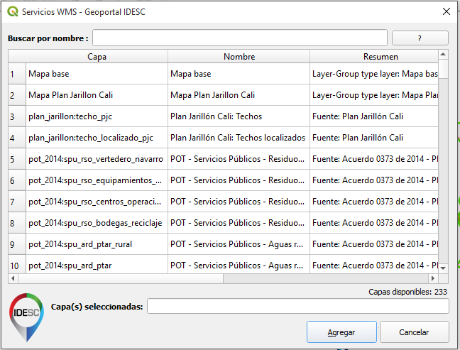

# IDESCali WMS - QGIS Plugin

Este plugin provee acceso a los servicios WMS de la Infraestructura de Datos Espaciales de Santiago de Cali (IDESC)

https://www.cali.gov.co/planeacion/publicaciones/46691/servicios_wms_idesc/

## Captura 

Con este plugin usted puede:

- Acceder a capas WMS de manera simple disponibles a través de la infraestructura de Datos Espaciales de Santiago de Cali (IDESC)

## Requerimientos

- QGIS 3x

## Descarga

El plugin puede ser descargado [idescali_ws.zip](idescali_ws.zip) e instalado en  QGIS desde el administrador de complementos -> opción (Instalar a partir de ZIP)

## Creditos

Code based on the  [Bhuvan ISRO's Geoportal QGIS plugin](https://github.com/brenykurien/bhuvan_web_services).
